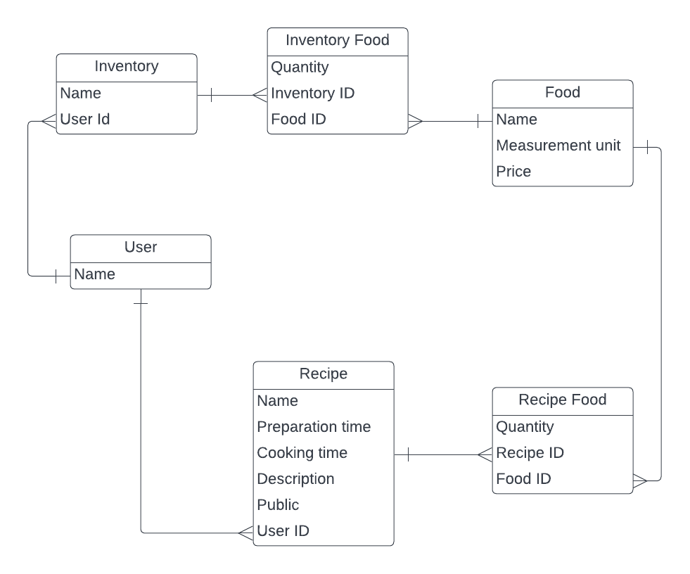

# Food App

# Table of Contents

- [About the Project](#about-project)
  - [Built With](#built-with)
    - [Tech Stack](#tech-stack)
    - [Key Features](#key-features)
- [Getting Started](#getting-started)
  - [Setup](#setup)
  - [Prerequisites](#prerequisites)
  - [Install](#install)
  - [Usage](#usage)
  - [Run tests](#run-tests)
  - [Deployment](#triangular_flag_on_post-deployment)
- [Authors](#authors)
- [Future Features](#future-features)
- [Contributing](#contributing)
- [Show your support](#support)
- [Acknowledgements](#acknowledgements)
- [FAQ](#faq)
- [License](#license)

<!-- PROJECT DESCRIPTION -->

# [Food App] 

**[Food App]** The Food app will be a classic example of a Food App. It is a functional website that will show the list of shopping and empower readers to interact with them by adding recipes and inventories and generating shopping list.It has been made by the following ERD diagram.

## Built With 

### Tech Stack 

  
Ruby

  <ul>
    <li><a>https://www.ruby-lang.org/en/</a></li>
  </ul>

<!-- Features -->

### Key Features 

 - [ ] **[Creating a data model]**
 - [ ] **[Processing data in models]**
 - [ ] **[Validations and Model specs]**
 - [ ] **[Setup and controllers]**
 - [ ] **[Views]**
 - [ ] **[Forms]**
 - [ ] **[Integration specs for Views and fixing n+1 problems]**
 - [ ] **[Add Devise]**
 - [ ] **[Add authorization rules]**

(<a href="#readme-top">back to top</a>)

<!-- GETTING STARTED -->

## Getting Started 

To get a local copy up and running, follow these steps.

### Prerequisites

In order to run this project you need:

 - `bundle install`

### Setup

Clone this repository to your desired folder:

- cd `Food-app-rails`
- `(https://github.com/bilalrajput09/Food-app-rails.git)`

### Install

Install this project with:

- cd Food-app-rails
- bundle install

### Usage

To run the project execute the following command:

- rspec spec
- rails routes

### Run tests

To run tests, run the following command:

- `rubocop`
- `rspec .`
- `rails server`

(<a href="#readme-top">back to top</a>)

<!-- AUTHORS -->

## Authors 

👤 **Ashna Ali**
- GitHub: [@githubhandle](https://github.com/Ashnaali3255)
- Twitter: [@twitterhandle](https://twitter.com/Ashna_Ali1)
- LinkedIn: [LinkedIn](https://www.linkedin.com/in/ashna-ali-342151255/)

👤 **Bilal Ahmed**

- GitHub: [@bilalrajput09](https://github.com/bilalrajput09)
- Twitter: [@bilal_rajput09](https://twitter.com/bilal_rajput09)
- LinkedIn [Bilal Rajput](https://www.linkedin.com/in/bilal-ahmed-18b12019a/)

👤 **IRADUKUNDA Pacific Rugwizangoga**

- GitHub: [@githubhandle](https://github.com/rugwizangoga)
- LinkedIn: [LinkedIn](https://www.linkedin.com/in/iradukunda-pacific-rugwizangoga)

(<a href="#readme-top">back to top</a>)

<!-- FUTURE FEATURES -->

## Future Features 

- [ ] **[Food App ]**

(<a href="#readme-top">back to top</a>)

<!-- CONTRIBUTING -->

## 🤝 Contributing 

Contributions, issues, and feature requests are welcome!

Feel free to check the [issues page](../../issues/).

(<a href="#readme-top">back to top</a>)

<!-- SUPPORT -->

## ⭐ Show your support 

Give a ⭐ if you like this project

(<a href="#readme-top">back to top</a>)

<!-- ACKNOWLEDGEMENTS -->

## 🙏 Acknowledgments 

I would like to thank...
- Microverse for the detailed requerements provided.

(<a href="#readme-top">back to top</a>)

<!-- LICENSE -->

## 📝 License 

This project is [MIT](./license) licensed.

(<a href="#readme-top">back to top</a>)
